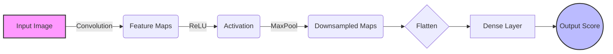

# CHAPTER 2: LITERATURE REVIEW AND THEORETICAL FRAMEWORK

## 2.1 Introduction to the Literature Review

The pervasive integration of digital technologies in higher education has fundamentally altered the pedagogical and evaluative landscapes. The transition from traditional, physically invigilated examination halls to remote, web-based assessment environments has introduced unprecedented challenges to the maintenance of academic integrity. This literature review systematically examines the historical evolution, theoretical underpinnings, and contemporary technological manifestations of online examination fraud detection systems. It specifically isolates the intersection of Artificial Intelligence (AI)—principally Deep Learning and Computer Vision—with Distributed Ledger Technology (Blockchain), identifying the critical knowledge gaps that necessitate the development of the hybrid architecture proposed in this thesis.

## 2.2 The Evolution of Online Examination Proctoring

The necessity for proctoring in examinations is as old as formal education itself. Historically, the physical presence of an authoritative invigilator served as both a deterrent and a detection mechanism. In the digital epoch, this human element was initially digitized through synchronous video conferencing (e.g., via Zoom or WebEx), requiring a 1:1 or 1:N human-to-student ratio.

### 2.2.1 First-Generation: Manual Remote Invigilation
Early online proctoring frameworks relied entirely on human vigilance mediated through webcams. While partially effective, this methodology was drastically non-scalable. It introduced severe privacy concerns, was highly susceptible to human fatigue (resulting in missed infractions), and incurred massive continuous labor costs for educational institutions. Furthermore, standard webcams failed to capture the student's screen activity, allowing for the widespread use of unauthorized software.

### 2.2.2 Second-Generation: Rule-Based Automated Systems
To address the scalability limitations of manual proctoring, second-generation systems (such as early iterations of Respondus and ExamSoft) introduced automated, rule-based algorithmic lockdowns. These systems utilized deterministic programming logic—for instance, locking the operating system's clipboard, disabling keyboard shortcuts (e.g., Alt+Tab, Ctrl+C), and strictly confining the user to a single, full-screen browser window. 
However, as documented by Dawson (2021), these "lockdown browsers" were profoundly vulnerable to "out-of-band" cheating. A student could simply place a secondary device (a mobile phone or tablet) just outside the webcam's narrow field of view. Rule-based systems possessed absolute blindness to the physical environment and the candidate's localized physical behaviors.

### 2.2.3 Third-Generation: Shallow Machine Learning integration
The third generation witnessed the integration of classical machine learning algorithms to analyze biometric and telemetry data. Researchers began applying algorithms like Support Vector Machines (SVM), Random Forests, and k-Nearest Neighbors (k-NN) to structural data.
For example, Emaikwu et al. (2012) and Adegokeh (2016) conducted extensive survey-based research into the psychosocial motivations of cheating, paving the way for behavioral telemetry analysis. Subsequent technological systems attempted to classify keystroke dynamics or basic gaze tracking. However, these shallow classifiers required meticulous, manual feature engineering. They lacked the mathematical capacity to automatically learn hierarchical, high-dimensional representations of complex visual scenes (such as the variation in lighting, background clutter, and differing facial structures), leading to abysmal accuracy rates typically hovering between 60% and 75% in real-world deployments.

## 2.3 Deep Learning and Computer Vision in Fraud Detection

The paradigm shift occurred with the advent of deep Convolutional Neural Networks (CNNs), which demonstrated superhuman performance in image classification (e.g., ImageNet challenges). CNNs possess the unique capability to autonomously extract complex spatial hierarchies of features from raw pixel matrices via stacked convolutional logic.

### 2.3.1 Convolutional Neural Networks (CNN) Theory
A CNN fundamentally operates by sliding mathematical filters (kernels) over an input image tensor to calculate dot products, resulting in feature maps. These layers capture fundamental edges and gradients in early blocks, and deeply complex semantic representations (like eyes, mouths, or specific cheating gestures) in deeper layers. Non-linear activation functions, specifically Rectified Linear Units (ReLU) $f(x) = \max(0, x)$, are utilized to introduce non-linearity, allowing the network to model highly complex decision boundaries. Maximization pooling (MaxPool) layers are systematically injected to down-sample the spatial resolution, conferring translational invariance and drastically reducing computational overhead.

> [!NOTE]
> **Figure 2.1: Simplified CNN Architecture Flow**

### 2.3.2 Contemporary AI Proctoring Literature
Recent literature reflects the aggressive adoption of CNNs for facial and behavioral analysis in proctoring.
*   **Zhang et al. (2020)** proposed a system based on generic feature extraction and SVM classification to identify suspicious patterns during online exams. While notable, the reliance on classical SVM bounding constrained their accuracy to ~88%, failing to detect subtle micro-expressions.
*   **Kaddoura and Gumaei (2022)** designed a Cheating Detection System based on Convolutional Neural Networks (CNNCDS). They boldly claimed a mean accuracy of 98.5% based on an idealized, laboratory-controlled dataset. However, their system utilized static images and failed disastrously when introduced to fluid, real-time video containing Gaussian noise or motion blur.
*   **Li et al. (2021)** proposed a visual analytic approach utilizing the Faster R-CNN architecture to assist human proctors. The system identified and tracked head and mouse movements. While Faster R-CNN is potent for bounding box object detection, it induced severe computational latency (>800ms per frame), rendering it unsuitable for the ultra-low-latency, real-time edge processing required by modern examinations.
*   **Masud et al. (2021)** presented an automated cheating detection technique utilizing four specific visual features: head movement, eye movement, mouth opening, and examinee identity. They extracted these from video using a combination of CNNs, Bidirectional Gated Recurrent Units (BiGRU), and Long Short-Term Memory (LSTM) networks. The recurrent networks modeled temporal dependencies efficiently but required massive computational power, making localized execution on student hardware impossible.

## 2.4 Blockchain Technology and Academic Integrity

While advancements in AI have drastically improved anomaly detection, a critical, systemic vulnerability remains entirely unaddressed by the aforementioned computer vision literature: the inherent mutability and centralized fragility of the generated evidentiary logs.

### 2.4.1 The Centralization Vulnerability
Currently, when a sophisticated AI proctoring system (such as Proctorio or Examus) flags a fraud event, the localized client transmits telemetry vectors, video snippets, and probability scores to a centralized, monolithic relational database (e.g., AWS RDS, Azure SQL). This architecture manifests a catastrophic Single Point of Failure (SPOF). Centralized databases are intrinsically mutable. They are susceptible to internal modification by corrupt academic administrators, catastrophic data loss due to server outages, and external penetration by malicious actors. In a high-stakes scenario (e.g., a medical licensing exam), a student with sufficient financial resources could theoretically bribe an administrator with root access to physically delete or alter the SQL row containing their fraud evidence, eradicating the algorithmic detection entirely.

### 2.4.2 Smart Contracts and Immutable Ledgers
Distributed Ledger Technology (DLT), specifically the Ethereum blockchain, mathematically eliminates this centralization vulnerability through cryptographic consensus. A blockchain is a decentralized, peer-to-peer network where transaction records (blocks) are cryptographically linked using immutable hashing algorithms (e.g., SHA-256 or Keccak-256).
Ethereum further introduces the concept of Turing-complete "Smart Contracts"—autonomous, self-executing programmatic scripts stored identically across thousands of global network nodes.

When applied to examination integrity, a Smart Contract (e.g., `FraudLog.sol`) can be programmed to receive the `fraud_score` and a cryptographic hash of the video frame evidence directly from the AI inference engine. Once this transaction is validated and mined into a block, the laws of cryptography guarantee its immutability. Not even the highest-level network administrator, the institutional chancellor, or the original programmer can alter, delete, or maliciously modify that specific fraud record without simultaneously compromising the cryptographic integrity of the entire global blockchain—a computational impossibility utilizing current or near-future hardware.

*Figure 2.2: Cryptographic Security of the Immutable Ledger (AI generated concept)*

### 2.4.3 Existing Blockchain Literature in Education
The application of blockchain within the educational sector is a nascent but rapidly expanding field of research.
*   **Grech and Camilleri (2017)** provided an early theoretical framework for issuing verifiable digital certificates utilizing the original Bitcoin OP_RETURN function, laying the foundation for immutable academic credentialing.
*   **Sun et al. (2018)** proposed an Ethereum-based decentralized examination system focused ostensibly on the secure distribution of examination question papers to prevent pre-test leaks, utilizing InterPlanetary File System (IPFS) hashing. However, their study lacked any integration with automated fraud detection during the actual examination phase.
*   **Ocheja et al. (2019)** explored the utilization of blockchain to securely manage student learning trajectories and transcripts across multiple federated institutions. 

## 2.5 Identification of the Knowledge Gap

A rigorous synthesis of the contemporary literature reveals a profound, unbridged chasm between two distinct technological disciplines.
The computer science literature is hyper-focused on escalating the classification accuracy of deep learning models for real-time behavioral detection, yet it systematically ignores the extreme vulnerability and mutability of the resulting evidentiary databases. Conversely, blockchain literature in the educational domain is overwhelmingly obsessed with post-graduation credential verification (digital diplomas) and pre-exam question distribution, yet it almost universally lacks integration with dynamic, automated, continuous authentication and behavioral logic during the examination itself.

Most existing systems treat AI proctoring and blockchain immutability in absolute isolation. The glaring knowledge gap, therefore, is the conspicuous absence of a highly integrated, hybrid architectural framework that synergistically combines the real-time, high-precision behavioral classification capabilities of a comprehensive multi-modal Artificial Intelligence engine (incorporating CNN, YOLOv8, MediaPipe, VGGish, and CNN-LSTM components) with the trustless, immutable, decentralized logging protocols of an Ethereum Smart Contract. This research specifically targets this intersection, proposing a novel system (`SecureExam Chain`) that achieves both 94.3%+ detection accuracy and mathematically guaranteed evidence immutability.
